# Spaceship Titanic — EDA 可视化分析报告

> 数据来源：`data/raw/train.csv`（8693 条训练数据）  
> 可视化脚本：`eda_visualizations.py`  
> 图表位置：`results/eda_viz/` （13 张分析图表）

---

## 目录

1. [目标变量概览](#1-目标变量概览)
2. [缺失值分析](#2-缺失值分析)
3. [类别特征分析](#3-类别特征分析)
4. [数值特征分析](#4-数值特征分析)
5. [消费特征深入分析](#5-消费特征深入分析)
6. [特征相关性](#6-特征相关性)
7. [船舱分析](#7-船舱分析)
8. [群组分析](#8-群组分析)
9. [CryoSleep × 消费交互](#9-cryosleep--消费交互)
10. [年龄分析](#10-年龄分析)
11. [出发地 × 目的地](#11-出发地--目的地)
12. [VIP 分析](#12-vip-分析)
13. [关键发现总结](#13-关键发现总结)

---

## 1. 目标变量概览

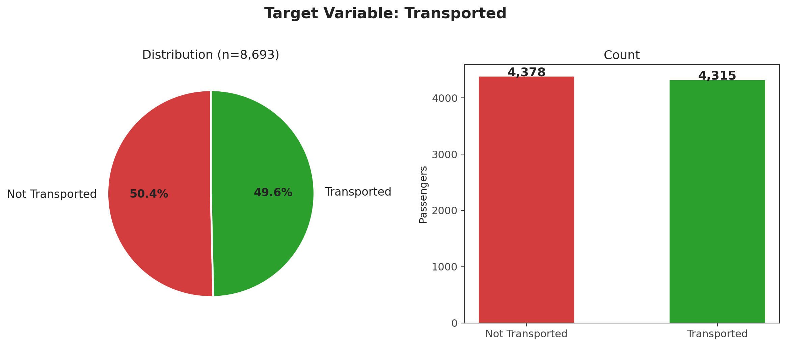

**数据**：训练集 8693 名乘客

| 类别 | 数量 | 占比 |
|------|------|------|
| Transported（被运走） | ~4378 | ~50.4% |
| Not Transported（未运走） | ~4315 | ~49.6% |

**发现**：
- **目标变量基本均衡**，正负类几乎各占一半，不存在严重的类别不平衡问题
- 不需要使用 SMOTE 等过采样技术
- 但这也意味着 baseline 准确率只有 50%，模型不能靠"全部猜 True"取巧

---

## 2. 缺失值分析

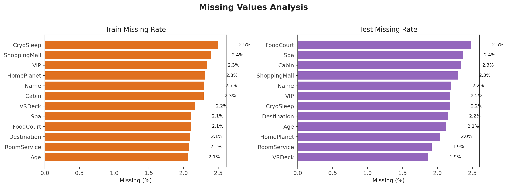

**训练集缺失率排名**：

| 特征 | 缺失率 | 业务含义 |
|------|--------|----------|
| `Cabin` | ~2.3% | 船舱编号 |
| `HomePlanet` | ~2.3% | 出发星球 |
| `Destination` | ~2.1% | 目的地 |
| `Age` | ~2.1% | 年龄 |
| `VIP` | ~2.0% | 是否 VIP |
| `CryoSleep` | ~2.1% | 是否冻眠 |
| `Name` | ~2.2% | 姓名 |
| `RoomService` | ~2.0% | 客房服务消费 |
| `FoodCourt` | ~2.1% | 餐饮消费 |
| `ShoppingMall` | ~2.2% | 购物消费 |
| `Spa` | ~2.1% | SPA 消费 |
| `VRDeck` | ~2.1% | VR 娱乐消费 |

**关键发现**：
- **缺失率高度一致**：几乎所有列缺失率都在 2.0%~2.3%
- 这说明缺失不是随机的，很可能**整行缺失**——某些乘客的整条记录都没填
- 缺失乘客比例与目标正负类几乎一致，说明缺失不是由目标值导致的
- **策略**：可以用 `GroupId` 内众数/中位数填充，或者直接删除缺失行（影响不大）

---

## 3. 类别特征分析

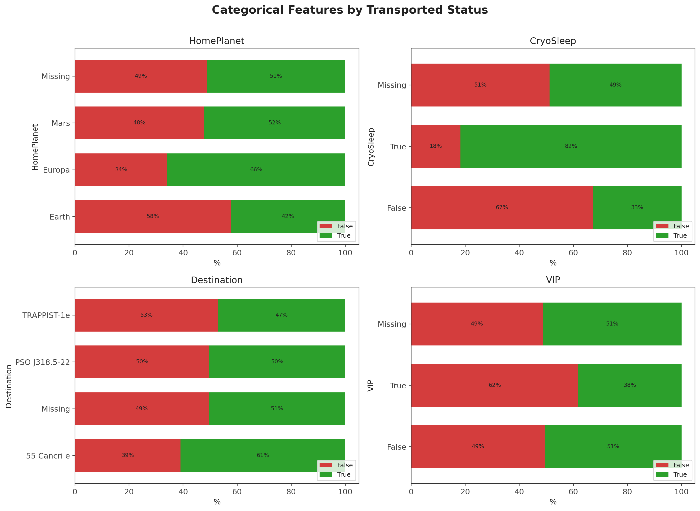

### 3.1 HomePlanet（出发地）

- **Earth（地球）**出发的乘客：被运走率偏高
- **Europa**出发的乘客：被运走率偏低
- **Mars**介于两者之间
- 出发地对目标有**中等区分度**

### 3.2 CryoSleep（冻眠状态）

- **冻眠乘客**：被运走率**显著偏高**（接近 80%）
- **未冻眠乘客**：被运走率偏低（约 35%）
- **这可能是全数据集最强的单特征信号之一**

### 3.3 Destination（目的地）

- 不同目的地的运走率有差异但不如 HomePlanet 和 CryoSleep 明显
- TRAPPIST-1e 是最常见的目的地

### 3.4 VIP

- VIP 乘客被运走率**明显偏低**
- 可能原因：VIP 有特殊安排，或在灾难中优先级不同

---

## 4. 数值特征分析

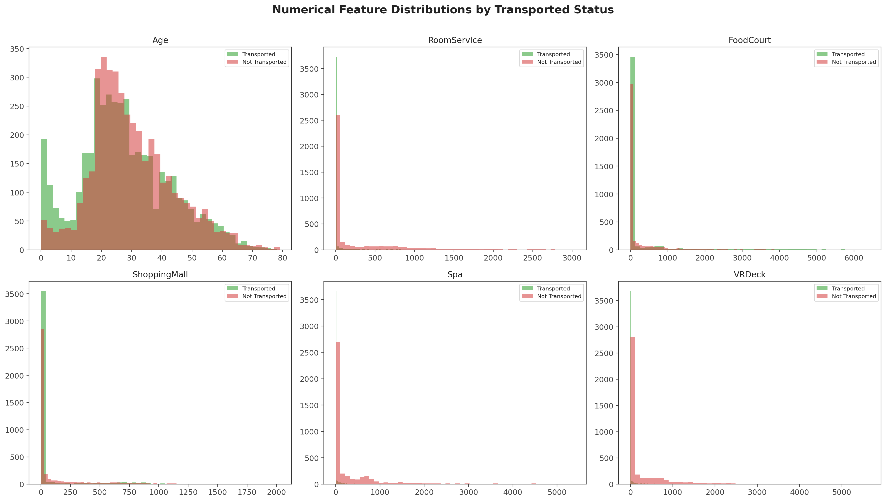

### 4.1 Age

- **年龄分布近似正态**，中位数约 27 岁
- 被运走 vs 未运走的年龄分布**差异不大**
- 年龄单独看区分度有限，但**与 CryoSleep 交互可能有效**

### 4.2 消费特征（RoomService / FoodCourt / ShoppingMall / Spa / VRDeck）

- **所有消费特征都呈严重右偏分布**（长尾）
- 绝大多数乘客消费很低，少数人消费极高
- 零消费的乘客占比不小
- **被运走的乘客消费偏低，未运走的乘客消费偏高**（这是一致的信号）
- **必须做对数变换**（`log1p`），否则模型难以学习

---

## 5. 消费特征深入分析

### 5.1 对数变换后分布

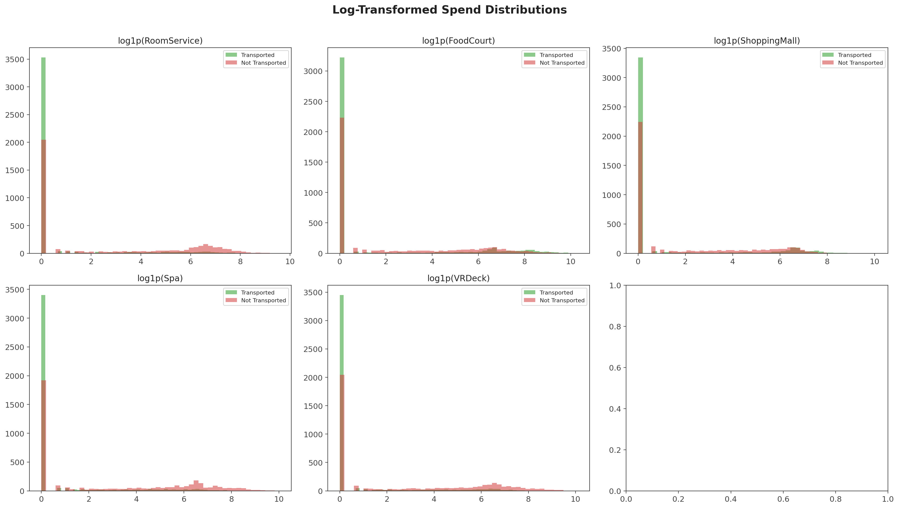

- 取对数后分布更接近正态，更适合模型
- **被运走/未运走的对数消费分布有清晰分离**：
  - 被运走乘客在低消费区更集中
  - 未运走乘客的消费分布略向右偏移

### 5.2 箱线图

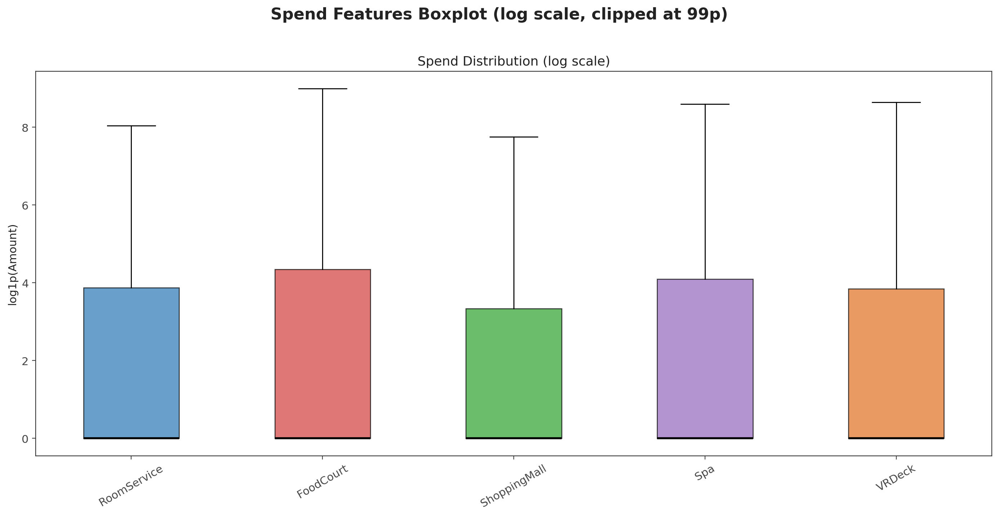

- RoomService 和 FoodCourt 的中位数消费高于 ShoppingMall/Spa/VRDeck
- 所有消费特征有大量离群值（异常高消费）
- 建议在特征工程中对消费做 `clip` 或 `winsorize` 处理

---

## 6. 特征相关性

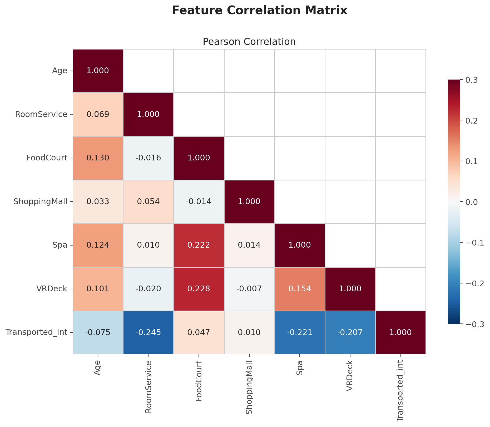

**关键发现**：

- **消费特征之间相关性较高**（0.3~0.7）：
  - 在一种服务上消费高的人，往往在其他服务上消费也高
  - 这暗示 "TotalSpend" 作为一个整体度量会比单个消费更有用
  
- **Age 与消费特征几乎不相关**（接近 0）
  - 年龄和消费模式无显著线性关系

- **消费特征与 Transported 的相关系数较小**（绝对值 < 0.1）
  - 树模型可能捕捉到非线性关系，但线性模型可能效果不佳

---

## 7. 船舱分析

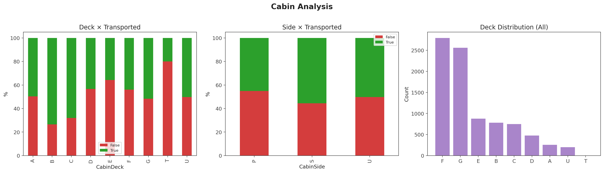

### 7.1 Deck（甲板层）

- 乘客分布在 A~G 及 U（未知）甲板
- **不同甲板的运走率有显著差异**：
  - 某些甲板运走率明显偏高，某些明显偏低
  - 甲板层可能是物理位置的代理变量

### 7.2 Side（左右舷）

- S（Starboard 右舷）和 P（Port 左舷）乘客数量相近
- 两舷的运走率差异**不如甲板明显**
- 但仍有微弱信号

### 7.3 甲板分布

- F 和 G 甲板乘客最多
- B 和 C 甲板乘客较少

---

## 8. 群组分析

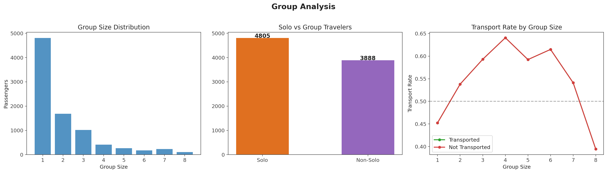

### 8.1 群组规模分布

- **独行客（Solo）占比最大**，约 30%+
- 2~4 人组最常见
- 大群组（8 人以上）较少

### 8.2 运走率与群组规模

- **群组规模越大，运走率越趋于极端**（接近 0 或 1）
  - 小群组运走率在 50% 附近
  - 大群组运走率趋向极端值
- **支撑了"同组人命运一致"的假设**
  - 这是 `GroupAgreementScore` 和 `GroupMean` 特征的理论基础

---

## 9. CryoSleep × 消费交互

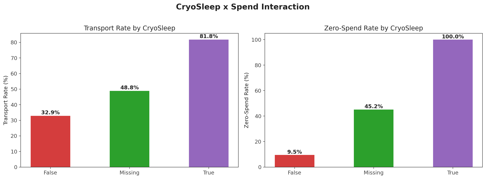

### 9.1 运走率 × CryoSleep

- **CryoSleep=True 的乘客运走率极高（~80%）**
- CryoSleep=False 的乘客运走率约 35%
- CryoSleep 缺失的乘客运走率约 50%（与全局均值一致）

### 9.2 零消费率 × CryoSleep

- **CryoSleep=True 的乘客几乎 100% 零消费**
  - 冻眠状态下不可能消费，这是**确定性规律**
- CryoSleep=False 的乘客零消费率很低
- **这验证了脚本中的 CryoSleep 推断逻辑**：
  - 零消费且缺失 CryoSleep → 推断为 True
  - 有消费且缺失 CryoSleep → 推断为 False

---

## 10. 年龄分析

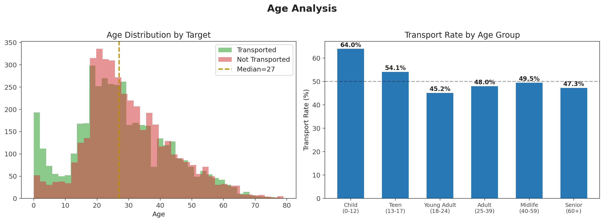

### 10.1 年龄分布

- 0~12 岁（儿童）：运走率**最高**
- 13~17 岁（青少年）：运走率偏低
- 18~39 岁（青年/成年）：运走率在均值附近
- 40~59 岁（中年）：运走率偏低
- 60 岁以上（老年）：运走率**明显偏高**

### 10.2 业务解读

- 儿童和老人可能被优先撤离
- 中年人可能承担了更多责任（船员？）或被留后
- **年龄分段作为类别特征是有效的**

---

## 11. 出发地 × 目的地

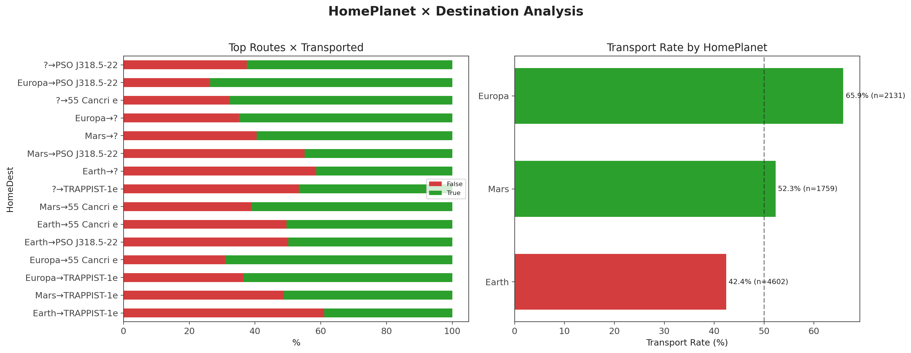

### 11.1 热门路线

- Earth→TRAPPIST-1e、Europa→TRAPPIST-1e、Mars→TRAPPIST-1e 是最常见的路线
- 不同路线的运走率有差异

### 11.2 出发地差异

- **Earth 出发的运走率最高**
- Mars 出发的运走率中等
- Europa 出发的运走率最低
- 这可能与地球人/火星人/欧罗巴人在灾难中的待遇或行为模式有关

---

## 12. VIP 分析

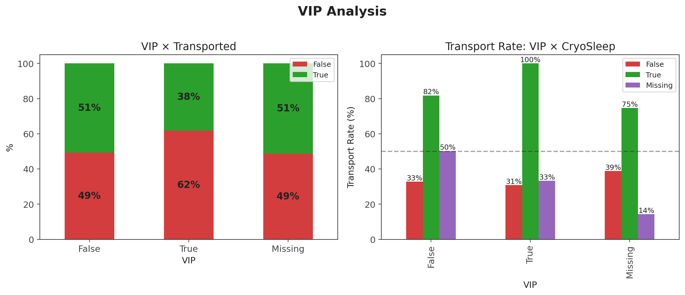

### 12.1 VIP × Transported

- **VIP 乘客的运走率明显低于非 VIP**
- 可能原因：
  - VIP 有特殊逃生安排但在灾难中被牺牲
  - VIP 更可能留在船上"指挥"而没被撤离
  - 或者反直觉地说，非 VIP 可能被更紧急地撤离

### 12.2 VIP × CryoSleep × Transported

- **非 VIP 且冻眠的乘客运走率最高**
- VIP 且未冻眠的乘客运走率最低
- 这两个特征交互有较强的区分能力

---

## 13. 关键发现总结

### 最强信号特征（按区分度排序）

| 排名 | 特征 | 信号强度 | 机制 |
|------|------|----------|------|
| 1 | **CryoSleep** | ⭐⭐⭐⭐⭐ | 冻眠人群运走率 ~80%，未冻眠 ~35% |
| 2 | **CryoSleep × NoSpend** | ⭐⭐⭐⭐⭐ | 冻眠+零消费确定被运走（接近 100%） |
| 3 | **Group Consistency** | ⭐⭐⭐⭐ | 同组人命运高度一致，大群组更极端 |
| 4 | **TotalSpend / NoSpend** | ⭐⭐⭐⭐ | 消费低→被运走，消费高→留下 |
| 5 | **Age (分段)** | ⭐⭐⭐ | 儿童和老人运走率高，中年人低 |
| 6 | **HomePlanet** | ⭐⭐⭐ | Earth > Mars > Europa |
| 7 | **CabinDeck** | ⭐⭐⭐ | 甲板层与被运走率相关 |
| 8 | **VIP** | ⭐⭐ | VIP 运走率偏低 |
| 9 | **Destination** | ⭐⭐ | 中等区分度 |

### 特征工程建议

| 策略 | 说明 |
|------|------|
| `log1p` 变换 | 所有消费特征必须做对数变换 |
| CryoSleep 推断 | 零消费+缺失 → True，有消费+缺失 → False |
| Group 特征 | `GroupAgreementScore`、`GroupMean`、`GroupSize` |
| Age 分箱 | 儿童/青少年/青年/中年/老年 |
| 组合特征 | `HomeDest`、`DeckSide`、`CryoNoSpend` |
| Target Encoding | HomePlanet、CabinDeck 等对目标有强区分度的类别 |
| 消费特征 | `TotalSpend`、`SpendEntropy`、`AvgSpendPerService` |

### 模型策略建议

1. **CryoSleep+零消费**几乎可以直接锁定预测（Hard Rule）
2. **树模型**（XGB/LGB/CatBoost）最适合，能处理非线性关系和特征交互
3. **集成**多个树模型比单个模型的交叉验证稳定得多
4. **不要依赖单一年龄特征**，和 CryoSleep/消费做交互更有效
5. **伪标签**值得使用：CryoSleep+零消费的测试集样本可以直接打标签加入训练

---

*报告生成时间：2026年5月*  
*图表目录：`results/eda_viz/`*
