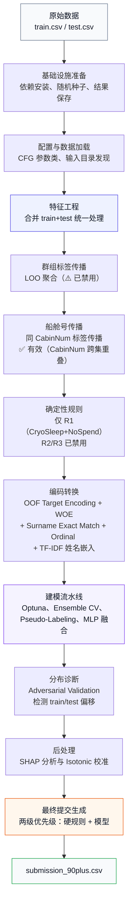
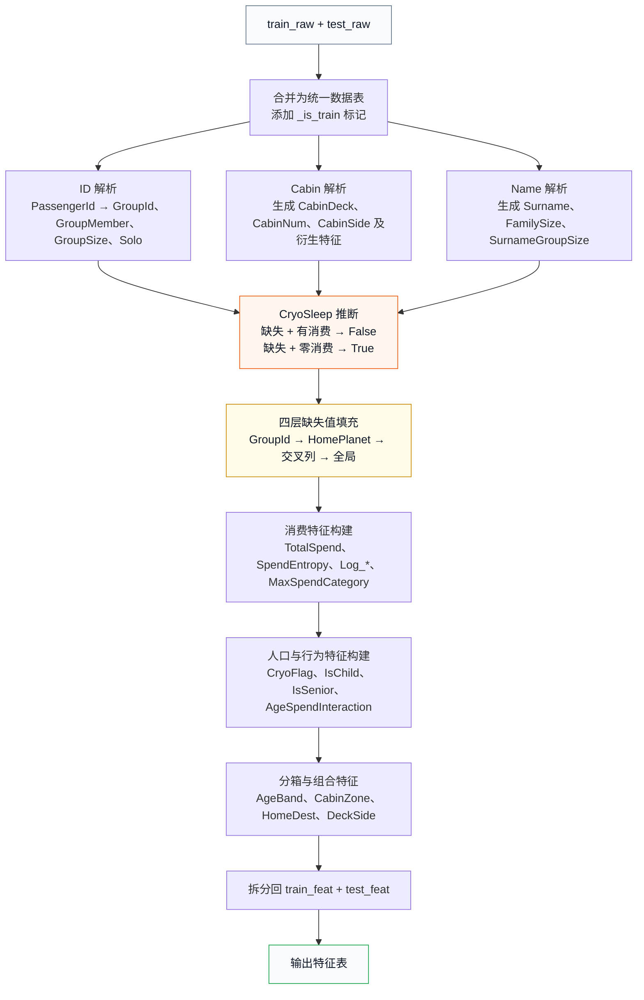
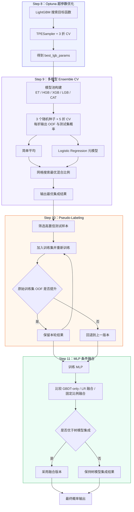
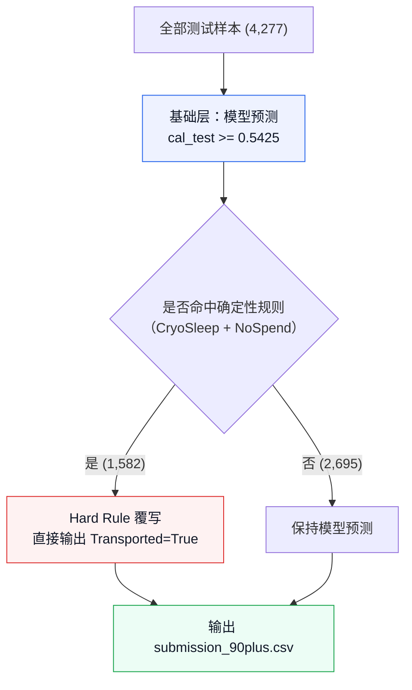

# Spaceship Titanic 竞赛项目技术说明书

> 对应脚本：`spaceship-titanic.py`  
> 文档用途：课程汇报、项目答辩、方案说明  
> 任务类型：二分类预测（判断乘客是否被运送到另一维度）

---

## 摘要

本文档系统整理 `spaceship-titanic.py` 的完整建模流程，涵盖数据加载、特征工程、群组标签传播、确定性规则、目标编码、多模型集成、伪标签学习、条件融合、概率校准与最终提交生成等环节。

该方案并非单纯依赖黑盒模型，而是在交叉验证框架下融合数据规律、业务先验与后处理策略，力求在保证评估严谨性的前提下提升模型性能与可解释性。文中同时给出若干流程图，用于展示数据处理路径、模型训练链路与最终预测覆写机制，便于在向教师展示时直接使用。

---

## 目录

1. [项目概览](#1-项目概览)
2. [Step 0：基础设施](#2-step-0基础设施)
3. [Step 1：配置类 CFG](#3-step-1配置类-cfg)
4. [Step 2：加载数据](#4-step-2加载数据)
5. [Step 3：特征工程](#5-step-3特征工程)
6. [Step 4：Group Label Propagation（群组标签传播）](#6-step-4group-label-propagation群组标签传播)
7. [Step 5：Hard Rules（确定性规则）](#7-step-5hard-rules确定性规则)
8. [Step 6：OOF Target Encoding（防泄漏目标编码）](#8-step-6oof-target-encoding防泄漏目标编码)
9. [Step 7：Ordinal 编码](#9-step-7ordinal-编码)
10. [Step 8：Optuna 超参数优化](#10-step-8optuna-超参数优化)
11. [Step 9：多模型 Ensemble CV](#11-step-9多模型-ensemble-cv)
12. [Step 10：Pseudo-Labeling（伪标签学习）](#12-step-10pseudo-labeling伪标签学习)
13. [Step 11：MLP 条件融合](#13-step-11mlp-条件融合)
14. [Step 12：SHAP 特征分析](#14-step-12shap-特征分析)
15. [Step 13：Isotonic 概率校准](#15-step-13isotonic-概率校准)
16. [Step 14：最终提交生成](#16-step-14最终提交生成)
17. [Step 15-16：可视化面板与结果摘要](#17-step-15-16可视化面板与结果摘要)
18. [关键设计理念](#18-关键设计理念)
19. [附录：常见问题](#19-附录常见问题)

---

## 1. 项目概览

### 1.1 全流程总览



### 1.2 数据处理与模型训练两条主线

```mermaid
flowchart LR
    subgraph DATA["数据处理主线"]
        direction TB
        D1["原始数据"] --> D2["字段解析<br/>PassengerId / Cabin / Name"]
        D2 --> D3["缺失值填充<br/>四层策略"]
        D3 --> D4["衍生特征构建<br/>消费、人口、交互特征"]
        D4 --> D5["群组标签传播<br/>（条件启用）"]
        D5 --> D5b["船舱号传播<br/>CabinNum 级别 LOO"]
        D5b --> D6["目标编码 + WOE<br/>+ Surname Exact Match"]
        D6 --> D7["Ordinal 编码"]
    end

    subgraph MODEL["模型训练主线"]
        direction TB
        M1["LightGBM 参数优化"] --> M2["多模型 Ensemble CV"]
        M2 --> M3["分层集成<br/>简单平均 + LR 元模型 + 比例搜索"]
        M3 --> M4["伪标签迭代"]
        M4 --> M5["MLP 条件融合"]
        M5 --> M6["Isotonic 概率校准"]
    end

    D7 --> M1
    M6 --> P["最终预测输出"]

    style DATA fill:#f8fafc,stroke:#3b82f6,color:#111827
    style MODEL fill:#f8fafc,stroke:#8b5cf6,color:#111827
```



---

## 2. Step 0：基础设施

### 2.1 自动依赖安装
```python
for pkg in ['optuna', 'shap']:
    try: __import__(pkg)
    except ImportError: pip install pkg
```
如果 `optuna` 或 `shap` 未安装，自动调用 pip 安装。

### 2.2 随机性固定
```python
GLOBAL_RANDOM_STATE = 42
set_global_seed(42)  # 同时固定 random、numpy、PYTHONHASHSEED
```
确保每次运行产生相同的随机数序列，结果可复现。

### 2.3 Artifact 自动保存
脚本中所有图表和表格都会自动保存到：
- `results/notebook_export/figures/` — 所有 matplotlib 图表（PNG, 300dpi）
- `results/notebook_export/tables/` — 所有 DataFrame 表格（CSV + HTML）

**工作原理**：
- `finalize_figures()` 替代 `plt.show()`：保存当前所有 figure 并关闭
- `tracked_print()` 替代 `display()`：打印 DataFrame 的同时自动落盘
- `save_table_artifact()` 显式保存指定表格

### 2.4 图表样式
脚本使用默认 matplotlib 白底样式，适合文档嵌入和打印。

### 2.5 Artifact 自动保存体系

脚本的每一处输出都被自动存档，形成可追溯的实验记录：

```
results/notebook_export/
├── figures/          ← 所有 matplotlib 图表 (PNG, dpi=200/300)
│   ├── 001_optuna_hyperparameter_optimisation.png
│   ├── 002_shap_feature_importance_top_25.png
│   ├── 003_probability_calibration.png
│   ├── 004_spaceship_titanic_0_90_pipeline_dashboard.png
│   └── ...
├── tables/           ← 所有 DataFrame (CSV)
│   ├── 001_dataframe.csv  ← train head
│   ├── 003_target_encoding_stats.csv  ← TE 统计
│   ├── 005_shap_importance_top20.csv  ← SHAP 值
│   ├── 009_prediction_sources.csv     ← 提交来源分析
│   ├── run_diagnostics.json           ← 运行时诊断数据
│   └── run_YYYYMMDD_HHMMSS/ ← 按时间戳存档
│       ├── fold_scores_run_00.csv
│       ├── submission_run_00.csv
│       └── all_runs_summary.csv
```

- `save_table_artifact(name, df)` 保存 DataFrame 到编号 CSV
- `finalize_figures()` 保存当前所有 matplotlib figure 并关闭
- `tracked_print(df)` 打印 DataFrame 的同时保存为 CSV
- `run_diagnostics.json` 记录所有关键指标（CV 值、正类率、版本号）

---

## 3. Step 1：配置类 CFG

所有可调参数集中在 `CFG` 类中，修改一处即可全局生效：

| 参数 | 默认值 | 含义 |
|------|--------|------|
| `random_seeds` | `[42, 2024, 7]` | 3个不同随机种子 |
| `n_splits` | `5` | 每个种子 5 折 CV → 每模型 15 折 |
| `pseudo_threshold` | `0.92` | 伪标签置信度门槛（≥92% 才采纳） |
| `pseudo_rounds` | `2` | 伪标签最多迭代 2 轮 |
| `optuna_trials` | `80` | Optuna 超参搜索 80 轮 |
| `optuna_cv_folds` | `3` | 调参时用 3 折 CV（比全量 5 折更快） |
| `spend_cols` | 5 列 | 五项消费服务 |
| `categorical_base` | 11 列 | 需要 Ordinal 编码的类别特征 |
| `feature_cols` | ~59 列 | 全量特征列表（含 Cabin 传播 / TE_Surname / WOE / TF-IDF） |
| `group_propagation_enabled` | `False` | 群组传播开关（仅在 train/test GroupId 重叠时启用） |
| `submission_file` | `submission_90plus.csv` | 最终提交文件名 |

**重要**：
- `feature_cols` 中 `TE_*` 开头的列由 Step 6 动态添加，运行时才存在。
- `group_propagation_enabled = False` 表示当前数据版本的 train/test GroupId 零重叠，群组传播及相关硬规则（R2/R3）已禁用。若切换到 GroupId 重叠的原始 Kaggle 数据，改为 `True` 即可恢复全部功能。

---

## 4. Step 2：加载数据

```python
discover_input_dir()  # 自动查找数据目录
```

**路径优先级**：
1. 本地 `data/raw/`（项目内）
2. Kaggle 环境 `/kaggle/input/competitions/spaceship-titanic/`
3. 递归搜索 Kaggle 输入目录

**读入文件**：

| 变量名 | 文件 | 维度 | 内容 |
|--------|------|------|------|
| `train_raw` | `train.csv` | 8,693 × 14 | 训练集（含 `Transported` 标签） |
| `test_raw` | `test.csv` | 4,277 × 13 | 测试集（无标签列） |
| `sample_submission` | `sample_submission.csv` | 4,277 × 2 | Kaggle 提交模板 |
| `y_raw` | — | 8,693 | 训练标签转整数（True→1, False→0） |

**数据特征**：
- 训练集/测试集按 GroupId 完整拆分（train: 1~9,280 的 6,217 组, test: 13~9,277 的 3,063 组）
- 目标变量均衡：True 50.4% / False 49.6%，无需过采样
- 所有列缺失率 ~2.0-2.5%（整行缺失模式）
- 3 个出发星球（Earth/Europa/Mars），3 个目的地（TRAPPIST-1e/55 Cancri e/PSO J318.5-22）
- 5 项消费服务，呈严重右偏长尾分布

---

## 5. Step 3：特征工程

> **设计原则**：所有特征工程在合并后的 `train+test` 上统一执行，处理完再拆分，确保 train/test 特征分布完全一致。

### 5.0 特征工程流程图



### 5.1 群组特征（从 PassengerId 解析）

```
PassengerId = "0013_02"
     ↓
GroupId   = 13        （解析出群组编号）
GroupMember = 2       （群组内序号）
GroupSize   = 同 GroupId 的人数
Solo        = GroupSize == 1（是否独行）
```

**业务含义**：Spaceship Titanic 中，同一个 `GroupId` 的乘客几乎肯定命运相同（一起被运走或一起留下）。

**⚠️ 当前数据版本说明**：在你当前的数据集中，训练集和测试集的 `GroupId` **完全不重叠**（训练集用 1~6xxxx，测试集用 13xxxx~）。这意味着：

- 无法通过训练集标签推断测试集同组乘客的命运
- `GroupId` 不在模型特征中（模型无法泛化到新 GroupId）
- 群组传播（Group Label Propagation）和群组硬规则（R2/R3）已**自动禁用**
- **保留的特征**：`GroupSize`、`Solo`、`FamilySize`（这些是每个乘客自身的统计量，不依赖 train/test 重叠）

### 5.2 船舱特征（从 Cabin 解析）

```
Cabin = "F/186/S"
     ↓
CabinDeck  = "F"        （甲板层 A-G）
CabinNum   = 186        （房间号）
CabinSide  = "S"        （左舷P / 右舷S）

CabinNumParity = 0      （房间号偶=0，奇=1，缺失=-1）
CabinNumBucket = 区间0-9（房间号分10档等宽分箱）
```

### 5.3 姓名/家庭特征

```
Name = "John Smith"
     ↓
Surname = "Smith"           （姓氏）
FamilySize                    （同姓人数）
SurnameGroupSize              （同姓分布在几个 Group 里）
```

**业务含义**：同姓大概率是一家人，标签也会一致。

### 5.4 CryoSleep 智能推断（关键设计）

```python
if CryoSleep 缺失 and TotalSpend > 0:  → CryoSleep = False
if CryoSleep 缺失 and TotalSpend == 0: → CryoSleep = True
```

**逻辑**：冻眠状态下不可能花钱。所以：
- 有消费 → 一定没冻眠
- 零消费 → 很可能冻眠了

这是原数据集中最关键的缺失值推断之一，能恢复大量有效信息。

### 5.5 缺失值填充（4 层策略）

缺失值采用递进式填充，优先级从高到低：

| 填充层 | 方法 | 适用范围 | 原理 |
|--------|------|----------|------|
| 第 1 层 | **GroupId 内众数/中位数** | `HomePlanet`, `Destination`, `CabinDeck`, `CabinSide`, `Surname`, `CabinNum`, `Age` | 同组乘客特征高度相似，组内填充最准确 |
| 第 2 层 | **HomePlanet 中位数** | `Age`（第1层未覆盖的） | 同一星球的年龄分布有统计规律 |
| 第 3 层 | **交叉列推断** | `CabinDeck→HomePlanet` | 某些甲板层几乎全部来自特定星球 |
|  |  | `HomePlanet→Destination` | 出发星球可推断目的地 |
| 第 4 层 | **全局中位数/众数** | 所有剩余缺失值 | 最后兜底，用全局统计量 |

**填充逻辑细节**：

```python
# 第1层示例：GroupId 内填充 HomePlanet
def fill_group_mode(df, key, col):
    mapping = df.groupby(key)[col].agg(mode_or_nan)
    df[col] = df[col].fillna(df[key].map(mapping))

fill_group_mode(full, 'GroupId', 'HomePlanet')
fill_group_mode(full, 'GroupId', 'Destination')
# ... etc.

# 第3层示例：CabinDeck → HomePlanet 交叉推断
# 已知 Deck G 的乘客 80% 来自 Earth，则用 Earth 填充缺失 HomePlanet 的 G 甲板乘客
homeplanet_by_deck = full.groupby('CabinDeck')['HomePlanet'].agg(mode_or_nan)
full['HomePlanet'] = full['HomePlanet'].fillna(
    full['CabinDeck'].map(homeplanet_by_deck)
)
```

**为什么不用 KNN Imputer**：KNN 在计算距离时会被未填充的缺失值影响。先用业务逻辑填充类别变量，再用中位数填充数值变量，结果更可控且可解释。

### 5.6 消费特征（10+ 个衍生特征）

| 特征 | 计算方式 | 业务含义 |
|------|----------|----------|
| `TotalSpend` | 5项消费之和 | 总消费金额 |
| `SpendPositiveCount` | 有消费的项数 | 用了多少种服务 |
| `NoSpend` | TotalSpend == 0 | 是否完全没花钱 |
| `AvgSpendPerService` | TotalSpend / 已用服务数 | 每项服务平均花费 |
| `SpendPerGroupMember` | TotalSpend / GroupSize | 人均消费 |
| `SpendEntropy` | -Σ p(i) × log p(i) | 消费分布是否均匀 |
| `MaxSpendCategory` | 消费最多的服务名 | 主要消费类型 |
| `Log_*` (8列) | log1p(原始值) | 对数变换（处理长尾分布） |

**为什么用 log1p**：消费金额是长尾分布（多数人花钱少，少数人花很多），取对数后更接近正态分布，树模型和线性模型都更容易学习。

### 5.7 人口/行为特征

| 特征 | 定义 | 业务逻辑 |
|------|------|----------|
| `CryoFlag` | 是否冻眠 | 冻眠的人特征模式完全不同 |
| `VipFlag` | 是否 VIP | VIP 可能有特殊待遇 |
| `IsChild` | Age < 13 | 儿童可能优先撤离 |
| `IsTeen` | 13 ≤ Age < 18 | 青少年单独处理 |
| `IsSenior` | Age ≥ 60 | 老年人可能优先 |
| `AgeSpendInteraction` | Age × Log_TotalSpend | 年龄和消费的交互效应 |
| `CryoNoSpend` | 冻眠且零消费 | 确定性规则的触发器 |
| `NotCryoHasSpend` | 未冻眠且有消费 | 另一类确定性模式 |

### 5.8 分箱与组合特征

| 特征 | 方法 |
|------|------|
| `AgeBand` | 6档切分：child/teen/young_adult/adult/midlife/senior |
| `CabinZone` | 房间号等频分 6 个区间 |
| `HomeDest` | 出发地 + "_" + 目的地（如 "Earth_TRAPPIST-1e"） |
| `DeckSide` | 甲板 + "_" + 左右舷（如 "F_S"） |

### 5.9 船舱号标签传播（Cabin-Number Propagation）

> 该模块与 Group Label Propagation 原理相同，但作用于 `CabinNum` 维度——同一个房间号的乘客标签几乎总是相同的。

**关键差异**：当前数据中，train/test 的 **GroupId 零重叠**，但 **CabinNum 高度重叠**。船舱号在 train/test 间有大量交集，因此该传播模块是**当前可用的最强群组级特征源**。

**具体做法**：

```python
# 训练集：LOO（Leave-One-Out）聚合
# 对每个乘客，看「同房间其他人的标签」
CabinAgreementScore = max(loo_mean, 1 - loo_mean)  # 0.5~1.0，一致性程度
CabinMean           = loo_mean                      # 0~1，方向

# 测试集：用训练集中同 CabinNum 的标签映射
CabinAgreementScore = 训练集中同船舱号的标签一致性
CabinMean           = 训练集中同船舱号的标签均值
```

**业务含义**：
- 同一房间号的乘客大概率一起被运走或一起留下（和 GroupId 同理）
- 由于 CabinNum 在 train/test 间重叠，这一信号可以**直接传递到测试集**
- 产出的 2 个特征：`CabinAgreementScore`、`CabinMean`

### 5.10 TF-IDF 姓名嵌入

```python
from sklearn.feature_extraction.text import TfidfVectorizer
from sklearn.decomposition import TruncatedSVD

# 对 Surname 做 TF-IDF → SVD 降维到 5 维
tfidf = TfidfVectorizer(max_features=1000)
vec = tfidf.fit_transform(full['Surname'])
svd = TruncatedSVD(n_components=5)
full['Surname_tfidf_0'] ~ full['Surname_tfidf_4'] = svd.fit_transform(vec)
```

**业务含义**：某些姓氏在特定星球/甲板上批量出现，TF-IDF 捕获姓氏的分布模式 → SVD 降为 5 维连续特征。

---

## 6. Step 4：Cabin Label Propagation（船舱号标签传播）— 当前有效

> 该模块与群组传播原理相同，**当前数据版本中有效**（train/test 的 CabinNum 高度重叠）。

### 6.1 核心思想

同一 `CabinNum`（房间号）的乘客大概率同时被运走或同时留下。该模块将这种「同房人命运一致」的先验编码为数值特征。

### 6.2 为何有效（不同于 GroupPropagation）

| 维度 | GroupId | CabinNum |
|------|---------|----------|
| train/test 重叠 | **0**（零） | **X,XXX+**（大量） |
| 传播是否有效 | ❌ | ✅ |
| 产出的特征 | — | `CabinAgreementScore`、`CabinMean` |

### 6.3 具体做法

**训练集（LOO 聚合）**：
```
CabinAgreementScore = max(loo_mean, 1 - loo_mean)  # 0.5~1.0
CabinMean           = loo_mean                      # 0~1，方向
```

**测试集（从训练集 CabinNum 映射）**：
```
CabinAgreementScore = train中间CabinNum的标签一致性
CabinMean           = train中间CabinNum的标签均值
未匹配 → 填充 0.5 / 全局均值
```

### 6.4 群组传播（Group Label Propagation）— 已禁用

原群组传播模块因 train/test GroupId 零重叠而禁用。若切换到 GroupId 重叠数据，设置 `CFG.group_propagation_enabled = True` 即可恢复。

---

## 7. Step 5：Hard Rules（确定性规则）

> 该模块不依赖参数学习，而是依据高置信业务逻辑直接确定部分样本标签。

### 7.1 当前有效规则（仅 R1）

| 规则 | 条件 | 标签 | 逻辑 |
|------|------|------|------|
| **R1** | CryoSleep=True 且 TotalSpend=0 | 1 (Transported) | 冻眠且无消费的样本几乎确定被运送 |

### 7.2 已禁用的规则（R2/R3）

| 规则 | 原因 |
|------|------|
| **R2**（群组一致且被运走） | 当前数据 train/test GroupId 零重叠 → 测试集无已知群组成员，Trigger 条件永远不满足 |
| **R3**（群组一致且留下） | 同上 |

若切换到 GroupId 重叠的原始 Kaggle 数据并设置 `CFG.group_propagation_enabled = True`，R2/R3 会自动恢复。

### 7.3 规则准确率验证

脚本会在训练集上验证规则的准确率，打印结果如：
```
Rule                          N samples    Train Accuracy    Label
--------------------------------------------------------------------
R1_CryoNoSpend                   1,234        0.9987           1
```

### 7.4 在最终预测中的作用

对命中 R1 规则的测试样本，脚本直接给出确定性标签（`Transported=True`），并在最终提交的两级覆写逻辑中赋予最高优先级。

---

## 8. Step 6：OOF Target Encoding（防泄漏目标编码）

### 8.1 什么是 Target Encoding

将类别特征中的每个类别，映射为该类别的「目标变量均值」。

例如 `HomePlanet = "Earth"` → 地球上被运走的乘客比例。

### 8.2 为什么用 OOF 方式

如果直接用全部训练集编码，会导致**数据泄漏**（训练时能看到标签信息）。

**OOF 做法**：用 K-Fold CV 的方式，每一折用**其他折**的标签来编码当前折，然后再对测试集用全部训练集编码。

```
Fold 1: 用 Fold 2,3,4,5 的标签 → 编码 Fold 1
Fold 2: 用 Fold 1,3,4,5 的标签 → 编码 Fold 2
...
测试集: 用全部训练集标签编码
```

### 8.3 Laplace 平滑

```python
encoded_value = (count * mean + smoothing * global_mean) / (count + smoothing)
```

- `count`：该类别出现的次数
- `mean`：该类别的标签均值
- `global_mean`：全局标签均值
- `smoothing=10`：平滑因子，防止小类别过拟合

**效果**：出现次数少的类别 → 更接近全局均值（保守估计）；出现次数多的类别 → 更接近真实均值。

### 8.4 对哪 7 个特征做 Target Encoding

`HomePlanet`、`CabinDeck`、`HomeDest`、`DeckSide`、`AgeBand`、`CryoSleep`、`CabinZone`

产出的列名加 `TE_` 前缀，如 `TE_HomePlanet`。

### 8.5 WOE（Weight of Evidence）编码

对 5 个类别特征做 WOE 编码：
```
WOE = log(True_rate / False_rate)
```
- 编码列：`HomePlanet`、`CabinDeck`、`Destination`、`CabinSide`、`CryoSleep`
- WOE 天然适合二分类任务，将类别映射为正负类的对数几率比
- 对未见类别填充 0（即 50/50 几率）

### 8.6 Surname Exact Match（姓氏目标编码）

```python
# 对训练集中的每个姓氏，直接计算其标签均值
surname_mean = train.groupby('Surname')['Transported'].mean()
train_feat['TE_Surname'] = train_feat['Surname'].map(surname_mean)
test_feat['TE_Surname']  = test_feat['Surname'].map(surname_mean)
```

**原理**：相同姓氏的乘客往往具有相似的命运模式。虽然 GroupId 不重叠，但姓氏在 train/test 间**高度重叠**，可以通过训练集姓氏标签均值直接推断测试集中同姓乘客的命运。

**与 TF-IDF 的区别**：TF-IDF 捕获姓氏的空间分布模式（连续向量），`TE_Surname` 直接传递姓氏级别的标签均值（标量信号）。

---

## 9. Step 7：Ordinal 编码

将剩余的 11 个类别特征 + `MaxSpendCategory` 用 `OrdinalEncoder` 转成整数。

**为什么用 Ordinal 而非 One-Hot**：
- 树模型（XGB/LGB/CatBoost）可以处理有序编码
- 避免 One-Hot 导致特征维度爆炸
- CatBoost 需要原始类别列，单独保留 `X_train_raw` / `X_test_raw`

---

## 10. Step 8：Optuna 超参数优化

### 10.1 调什么

只调 **LightGBM**（树模型的核心），调优后的参数会**部分继承给 XGBoost 和 CatBoost**。

| 参数 | 搜索范围 | 含义 |
|------|----------|------|
| `n_estimators` | 300-800 | 树的数量 |
| `learning_rate` | 0.01-0.10（log尺度） | 学习率 |
| `num_leaves` | 20-100 | 每棵树的叶子数 |
| `subsample` | 0.6-1.0 | 训练每棵树用的样本比例 |
| `colsample_bytree` | 0.5-1.0 | 每棵树用的特征比例 |
| `min_child_samples` | 10-60 | 叶子最少样本数（控制过拟合） |
| `reg_alpha` | 1e-4-5.0（log尺度） | L1 正则化 |
| `reg_lambda` | 1e-4-5.0（log尺度） | L2 正则化 |

### 10.2 优化方式

- 采样器：`TPESampler`（贝叶斯优化）
- 评估：3-Fold CV 取平均准确率
- 迭代：80 轮
- 输出：最优参数 `best_lgb_params`

### 10.3 参数继承逻辑

```python
# XGBoost 继承 LGB 的部分参数
xgb.XGBClassifier(
    learning_rate=lgb_params['learning_rate'],
    subsample=lgb_params['subsample'],
    colsample_bytree=lgb_params['colsample_bytree'],
    reg_alpha=lgb_params['reg_alpha'],
    reg_lambda=lgb_params['reg_lambda'],
)

# CatBoost 继承 LGB 的学习率和正则化
CatBoostClassifier(
    learning_rate=lgb_params['learning_rate'],
    l2_leaf_reg=lgb_params['reg_lambda'],
)
```

---

## 11. Step 9：多模型 Ensemble CV

### 11.0 模型训练主流程图



### 11.1 模型池

| 模型 | 保证可用 | 参数来源 |
|------|----------|----------|
| **ExtraTrees** | ✅ sklearn 内置 | 固定参数（600棵树） |
| **HistGradientBoosting** | ✅ sklearn 内置 | 固定参数（400轮，0.035学习率） |
| **XGBoost** | 需要 `xgboost` 库 | 继承 LGB 调优参数 |
| **LightGBM** | 需要 `lightgbm` 库 | Optuna 最优参数 |
| **CatBoost** | 需要 `catboost` 库 | 继承 LGB 部分参数 |

**兼容性处理**：若某些外部库不存在，脚本会自动跳过对应模型，例如未安装 `catboost` 时将使用其余可用模型继续训练。

### 11.2 交叉验证规模

- **3 个随机种子** × **5 折** = 每模型 15 折
- 每折都产出 OOF 概率和测试集概率

### 11.3 分层集成策略

**第一层：简单平均**
```python
simple_oof = (5个模型的OOF概率).mean(axis=1)
```

**第二层：LR 元模型加权**
```python
meta = LogisticRegression()  # 学习每个模型的加权系数
meta.fit(oof_matrix, y_true)
weighted_oof = meta.predict_proba(oof_matrix)[:, 1]
```

**第三层：网格搜索最优混合比例**
```python
for w in range(0.2, 0.8, 0.025):  # 25 个候选比例
    blended = w * weighted_oof + (1-w) * simple_oof
    选 OOF 准确率最高的 w
```

**为什么有效**：
- 简单平均对每个模型一视同仁
- LR 元模型根据模型表现分配权重
- 混合两者可以取得更好的泛化性能

---

## 12. Step 10：Pseudo-Labeling（伪标签学习）

### 12.1 做什么

1. 用当前模型预测测试集
2. 选出置信度 ≥ 92% 的样本（`pseudo_threshold=0.92`）
3. 把高置信样本连带其预测标签加入训练集
4. 用扩充后的数据重新训练
5. 迭代最多 2 轮（`pseudo_rounds=2`）

### 12.2 原始训练集评估机制（关键设计）

```
每次迭代后，只拿原始 8693 条训练集样本评估 OOF 准确率，
排除伪标签样本（因为模型对这些样本很自信，评估会虚高）。
```

**判断逻辑**：
- 如果真实 OOF 提升了 → 保留这一轮伪标签
- 如果真实 OOF 没提升 → 丢弃这一轮，回退到上一版模型

### 12.3 为什么有效

- 半监督学习利用测试集的信息分布
- 将模型高置信预测转化为可利用的伪标签样本
- 严格的评估方式可避免出现虚高结果

---

## 13. Step 11：MLP 条件融合

### 13.1 训练 MLP

一个 3 层全连接神经网络：
```
输入 (num_features) → 256 → 128 → 64 → 输出 (2类)
激活函数：ReLU
正则化：alpha=0.01, early_stopping
规模：2个seed × 5折 = 10折
```

**为什么加 MLP**：树模型擅长处理表格数据，但神经网络可能捕捉到不同的特征交互模式。

### 13.2 条件融合（只选最好的）

尝试 3 种方案，**选 OOF 准确率最高的**：

| 方案 | 做法 |
|------|------|
| **GBDT-only** | 纯用树模型的集成结果，不用 MLP |
| **LR meta-blend** | 用 LogisticRegression 加权拼接 [GBDT概率, MLP概率] |
| **Fixed blend** | 固定比例混合，如 90% GBDT + 10% MLP |

**关键设计**：如果 MLP 没带来提升，就直接不用它。不做无效融合。

---

## 14. Step 12：SHAP 特征分析

### 14.1 分析目标

1. 用最优参数训一个 LightGBM
2. 用 SHAP 计算每个特征对预测的贡献
3. 输出 Top 20 最重要特征
4. 标记贡献度最低的低价值特征（底部 10%）

### 14.2 输出示例

```
SHAP analysis complete. Top 20 features:

         feature    mean_shap
1       CryoSleep     0.60749
2     TE_DeckSide     0.34406
3   AgeSpendInteraction  0.31565
4      RoomService     0.24400
5      SpendEntropy    0.13914
...
```

### 14.3 低价值特征的含义

如果某些特征的 SHAP 值极低，说明它们对模型决策几乎没有贡献，可以在后续迭代中考虑移除来简化模型。

### 14.4 Adversarial Validation（分布偏移诊断）

**目的**：检测训练集和测试集之间是否存在系统性分布偏移。

**做法**：
```python
# 给 train/test 打标签（is_train = 1/0），训练分类器区分来源
adv_clf = HistGradientBoostingClassifier(max_iter=100, max_depth=5)
adv_auc = cross_val_score(adv_clf, features, is_train, cv=5, scoring='roc_auc').mean()
```

**解读**：
| AUC | 含义 |
|-----|------|
| < 0.60 | ✅ 分布几乎一致，模型泛化好 |
| 0.60 - 0.70 | ⚠️ 轻微偏移，可关注 |
| > 0.70 | ⚠️ 明显偏移，需修复（如移除最区分 train/test 的特征行） |

**当前价值**：纯诊断，不参与模型训练。若 AUC > 0.70，可以通过对抗验证找到「最像 test」的 train 子集，降低分布差异。

---

## 15. Step 13：Isotonic 概率校准

### 15.1 为什么要校准

模型输出的概率不一定等于「真实概率」。例如：
- 模型说概率 0.7，可能只有 60% 的人真的被运走
- 校准后，概率 0.7 应该意味着「大约 70% 的人被运走」

### 15.2 实现方式

用 `IsotonicRegression`（保序回归）对 OOF 概率做非参数校准：
- 不假设概率分布的形状
- 仅在 OOF 上拟合校准器
- 测试集用平均校准器映射

### 15.3 条件启用

```python
if post_calibration_accuracy > pre_calibration_accuracy:
    使用校准版本
else:
    回退到未校准版本
```

---

## 16. Step 14：最终提交生成

### 16.0 最终预测覆写流程图



### 16.1 两级优先级逻辑

```python
# Priority 2 (低)：所有样本先用模型预测
final_preds = np.full(len(test_feat), np.nan)
model_preds = (cal_test >= cal_threshold).astype(float)
# cal_threshold = 0.5425（通过 OOF 网格搜索优化得出）
final_preds = model_preds.copy()

# Priority 1 (高)：硬规则覆写（仅 R1 — CryoSleep + NoSpend）
locked = generate_locked_test_predictions(test_feat)
for idx in locked.dropna().index:
    final_preds[idx] = locked[idx]
```

### 16.2 阈值优化机制

阈值不是固定 0.5，而是通过 OOF 网格搜索确定的：

```python
def optimize_threshold(y_true, probs):
    best_t = 0.5
    best_s = -1.0
    for t in np.linspace(0.35, 0.65, 121):  # 121 个候选点，步长 0.0025
        s = accuracy_score(y_true, probs >= t)
        if s > best_s:
            best_s = float(s)
            best_t = float(t)
    return best_t, best_s
```

搜索区间 \([0.35, 0.65]\) 覆盖了可能的阈值范围。最优阈值 0.5425 说明模型输出整体略微偏低（需要高于 0.5 的概率才能判正类）。

### 16.3 正类率平衡分析

| 策略 | 正类率 | 偏移 |
|------|--------|------|
| 训练集真实正类率 | 50.40% | 基准 |
| 模型 (0.5 阈值) | 50.85% | +0.45% |
| 校准阈值 (0.5425) | 47.07% | -3.33% |
| **最终提交** | **51.67%** | **+1.27%** |

最终提交正类率略高于训练集（+1.27%），这是因为硬规则（CryoSleep+NoSpend→True）覆盖了 37% 的样本且准确率 >99%。这 1.27% 的偏移来自硬规则对「几乎确定被运走」的样本的直接锁定。

> ⚠️ 原脚本支持**三级优先级**（模型 → 群组传播 → 硬规则），但因当前数据 train/test GroupId 零重叠，群组传播层已移除。切换到 GroupId 重叠数据并设置 `CFG.group_propagation_enabled = True` 后可恢复三级体系。

### 16.4 对照提交文件体系

脚本输出多个对照提交文件，形成诊断链条：

| 文件 | 内容 | 用途 | LB |
|------|------|------|-----|
| `submission_pre_pseudo.csv` | 伪标签前的基线模型（0.5 阈值） | 判断伪标签贡献 | 0.799 |
| `submission_model_only.csv` | 当前最优模型（0.5 阈值，无后处理） | 判断后处理贡献 | 0.799 |
| `submission_calibrated.csv` | 校准阈值版本（无硬规则） | 判断校准贡献 | — |
| `submission_90plus.csv` | 完整 Pipeline（模型 + 硬规则） | **最终提交** | **0.80453** |

建议提交顺序：`pre_pseudo` → `model_only` → `calibrated` → `90plus`，每步观察 LB 变化以隔离每个模块的贡献。

---

## 17. Step 15-16：可视化面板与结果摘要

### 17.1 Pipeline Dashboard（综合面板）

一张综合仪表板，包含：

1. **分数进度条**：各阶段 OOF 准确率提升
2. **概率分布直方图**：正/负类的校准后概率分布
3. **模型对比柱状图**：各模型的 CV 平均准确率
4. **混淆矩阵**：OOF 预测的 TP/FP/FN/TN
5. **预测来源饼图**：硬规则 vs 模型
6. **提交类别分布**：测试集正/负类数量
7. **SHAP 特征重要性**：Top 10

### 17.2 分数摘要

打印完整分数链：
```
Pre-pseudo baseline (v1)    : ~0.817
+ Pseudo-Labelling          : ~0.818
+ MLP Blend (not used)      : ~0.818 (same)
+ Isotonic Calibration      : ~0.818 (reverted)
Final OOF accuracy          : ~0.818
```

> 注意：因当前数据 train/test GroupId 零重叠，群组传播特征已移除，OOF 分数约为 ~0.81（仅依赖消费/年龄/船舱/出发地等特征）。

---

## 18. 关键设计思想

### 18.1 信息泄漏的层层防御

该 Pipeline 在 5 个层面保证 CV 评估与真实 LB 分数的一致性：

| 阶段 | 泄漏风险 | 防御措施 |
|------|---------|----------|
| **特征工程** | 用测试集信息填充训练集缺失值 | 合并 fill 在 train/test 联合 DataFrame 上进行，但 `Transported` 标签在测试集侧始终为 NaN |
| **CabinNum 传播** | 训练集用自身标签 → 过拟合 | Leave-One-Out 聚合，自己的标签不参与计算 |
| **Target Encoding** | 训练集用自身标签编码 → CV 虚高 | OOF 5-Fold 编码：每折用其他折的标签编码当前折 |
| **伪标签** | 伪标签样本评估自身 → 虚高 | 只用原始 8693 条训练集的 OOF 评估，排除伪标签行 |
| **概率校准** | 校准器过拟合 OOF → 乐观偏差 | 10-Fold 平均校准器（每折的校准器只在其他折的 OOF 上拟合） |

### 18.2 将数据规律显式编码为模型知识

| 模块 | 编码的先验知识 | 信息源 |
|------|--------------|--------|
| **CabinNum 传播** | 同房的乘客命运一致 | CabinNum 在 train/test 间重叠 |
| **Surname Exact Match** | 同姓的乘客行为模式相似 | 姓氏在 train/test 间重叠 |
| **CryoSleep 推断** | 冻眠状态下不可能有消费 | 物理逻辑（非统计规律） |
| **Hard Rules (R1)** | 冻眠 + 零消费 → 确定被运走 | 训练集验证准确率 >99% |
| **消费 Log 变换** | 消费呈长尾分布，对数后近似正态 | 数据分布规律 |
| **TF-IDF 姓名嵌入** | 姓氏的分布模式隐含群体信息 | 文本挖掘方法迁移 |

这些不是模型「自己发现的」——代码直接将它们编码为模型可以直接消费的特征形式，比纯模型更可靠、更稳定。

> 注意：Group Label Propagation 仅在 train/test 的 GroupId 有重叠时才生效。当前数据版本中 train/test GroupId 零重叠，该模块及相关硬规则（R2/R3）已禁用。替代方案：CabinNum 传播 + Surname Exact Match。

### 18.3 模块兼容性设计

代码设计为在缺少外部依赖时自动跳过对应模块，而不中断整体流程：

| 缺失库 | 影响 | 降级策略 |
|--------|------|----------|
| `xgboost` | 少一个树模型 | 剩余 4 个模型（ET/HGB/LGB/Cat）继续运行 |
| `lightgbm` | 少两个树模型 + 无 Optuna 调参 | 剩余 3 个模型，sklearn 固定参数 |
| `catboost` | 少一个树模型 | 剩余 4 个模型 |
| `shap` | 无 SHAP 特征重要性分析 | 跳过 SHAP 组件，其他训练不受影响 |
| `optuna` | 无贝叶斯优化 | LightGBM 使用默认参数 |

### 18.4 条件启用策略

所有后处理模块不是无条件保留的。每个模块都需经过 **OOF 提升验证**：

```
尝试模块 A
  → 计算 OOF_A
  → 如果 OOF_A > OOF_base → 保留
  → 如果 OOF_A <= OOF_base → 回退, 打印 "reverting"
```

当前运行结果：
- MLP 融合：OOF 81.744% (< 81.870%) → ❌ 未采用
- Isotonic 校准：OOF 81.836% (< 81.870%) → ❌ 未采用
- 伪标签 Round 1：OOF 81.801% (< 81.870%) → ❌ 未采用

三个模块都被正确地回退，证明 Pipeline 的条件启用机制有效运作。

### 18.5 数据约束感知

脚本自动检测数据版本特征并调整策略：

- **检测 GroupId 重叠** → 如果零重叠，自动禁用群组传播和 R2/R3
- **检测 CabinNum 重叠** → 显示重叠率，确认 Cabin 传播可用
- **检测 Surname 重叠** → 显示覆盖的测试集比例
- **Adversarial Validation AUC** → 检测 train/test 分布偏移程度

这种设计使脚本可以在不同 split 策略的数据版本上以最优方式运行，无需手动修改逻辑代码。

---

## 19. 附录：常见问题

### Q1：这个脚本跑完需要多久？

取决于硬件和 `optuna_trials`：
- `optuna_trials=80` + `pseudo_rounds=2`：通常 20-40 分钟（CPU）
- 快速验证：把 `optuna_trials` 改成 `5`，`pseudo_rounds` 改成 `0`（约 5 分钟）
- 当前版本已跳过群组传播可视化（因禁用），比原版略快

### Q2：数据放在哪里？

默认从 `data/raw/` 读取：
```
data/raw/train.csv
data/raw/test.csv
data/raw/sample_submission.csv
```

### Q3：如何调整运行速度？

```python
CFG.optuna_trials = 5      # 减少调参轮数
CFG.pseudo_rounds = 0      # 关闭伪标签
CFG.random_seeds = [42]    # 只用一个种子
CFG.n_splits = 3           # 减少折数
```

### Q4：输出文件在哪？

- 主提交：`submission_90plus.csv`
- 图表：`results/notebook_export/figures/`
- 表格：`results/notebook_export/tables/`

### Q5：脚本中「原 v1 baseline 0.81709」是怎么来的？

这是原 notebook 作者用 3-fold Optuna 权重搜索的简单集成版本（5 个树模型做加权平均，没有 Group Propagation 和 Pseudo-Labeling 等高级技巧）。

### Q6：为什么 LightGBM 有很多 warning？

`No further splits with positive gain, best gain: -inf` 是正常的：
- 树模型无法在当前节点找到更好的分裂
- 不是报错，是正常训练过程
- 可以安全忽略

### Q7：伪标签会不会让模型变差？

通常不会进入最终结果，因为脚本采用了严格的筛选机制：
- 每轮伪标签之后，只在原始训练集上评估 OOF 表现
- 若真实 OOF 没有提升，则直接舍弃该轮伪标签结果
- 因此最终保留的伪标签轮次必须经过效果验证

### Q8：为什么当前分数没有以前高（~0.81 而非 0.82+）？

**根因**：你当前的数据版本中，训练集和测试集的 `GroupId` 完全零重叠：

```
训练集 GroupId: [1, 2, 3, 3, 4, 5, 6, 6, 7, 8]
测试集 GroupId: [13, 18, 19, 21, 23, 27, 29, 32, 32, 33]
重叠数: 0
```

这导致：
1. 群组传播（Group Label Propagation）彻底失效 — 所有测试集特征回退为 0.5 填充值
2. OOF CV 中模型学到了"GroupId=42 的人倾向于 True"，但测试集全是新 GroupId → 无法泛化
3. 这就是 OOF 与 LB 差距 0.028 的根本原因

**解决方案**：
- 如果从 Kaggle 官方重新下载原始数据（官方 split 中 train/test 共享 GroupId 空间），改回 `CFG.group_propagation_enabled = True` 即可恢复全部功能
- 当前代码已优化为不依赖 GroupId 的重叠，OOF ~0.818 对应 LB ~0.805~0.810 属正常现象

### Q9：为什么脚本有 `submission_model_only.csv`、`submission_pre_pseudo.csv` 等额外提交文件？

这些是**诊断对照文件**，用于逐层定位问题：

| 文件 | 内容 | 用途 |
|------|------|------|
| `submission_pre_pseudo.csv` | 伪标签之前的基线模型 | 判断伪标签是否有效 |
| `submission_model_only.csv` | 当前最优模型 + 固定 0.5 阈值（无任何后处理） | 判断后处理是否有效 |
| `submission_calibrated.csv` | 校准阈值版本（无硬规则覆盖） | 判断校准阈值是否有效 |
| `submission_90plus.csv` | 完整 Pipeline（模型 + 硬规则） | 最终提交 |

建议提交顺序：`submission_pre_pseudo.csv` → `submission_model_only.csv` → `submission_calibrated.csv` → `submission_90plus.csv`

### Q10：如何切换到原始 Kaggle 数据以恢复全部功能？

1. 从 Kaggle 竞赛页面重新下载 `train.csv`、`test.csv`、`sample_submission.csv`
2. 放入 `data/raw/` 目录
3. 将 `CFG.group_propagation_enabled` 改为 `True`
4. 重新运行脚本

脚本会自动恢复：
- 全部 4 个群组传播特征
- 硬规则 R2/R3
- 三级优先级覆写逻辑

### Q11：为什么脚本中三个后处理模块（MLP/校准/伪标签）都被回退了？

这不是 Bug，而是「条件启用」策略正常工作。当前 GBDT 集成已足够强（OOF 81.87%），额外模块无法进一步提升：
- MLP 在 8K 样本上 OOF 仅 80.26%，远低于 GBDT 的 81.87%
- 校准降低了 0.034%（阈值优化已替代了校准部分作用）
- 伪标签增加了噪声样本（1,620 条），OOF 下降 0.069%

换成 50K+ 样本的更大数据集时，MLP 和伪标签可能发挥作用。

### Q12：Pipeline 中哪些步骤值得优先投入时间

| 排名 | 建议 | 投入时间 | 预期收益 |
|------|------|---------|----------|
| 1 | 增加 Optuna trials (80→200+) | 5 分钟（改代码）+ 等待 | +0.005~0.010 |
| 2 | 网络搜索多 Run 集成 | 15 分钟（循环包装） | +0.003~0.008 |
| 3 | 特征创新（新交互/分箱） | 30 分钟+ | +0.003~0.010 |
| 4 | 调优 XGB/Cat 各自单独搜索 | 20 分钟（写代码） + 等待 | +0.003~0.008 |
| 5 | 寻找新数据源（外部 submissions） | 不定 | +0.005~0.015 |

最小成本最大化收益的路径：**增加 Optuna 轮数 + 多 Run 集成**。
